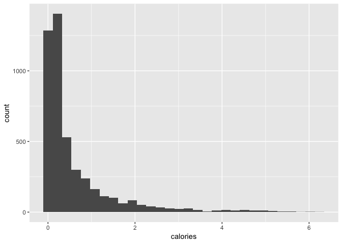
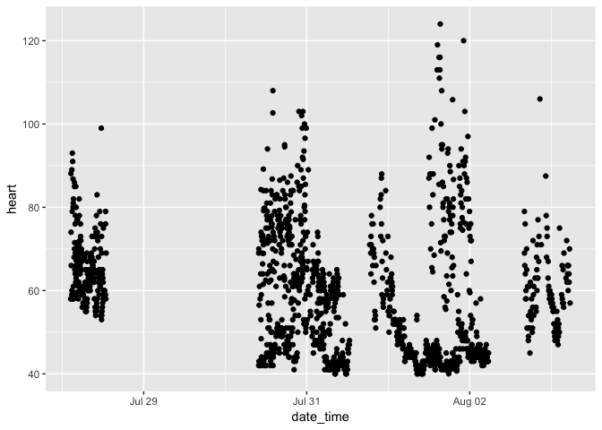

### Loading requires packages


```r
library(tidyverse)
```

## 1. Apple Watch Data

```r
aw_data <- read_csv("https://github.com/walkabilly/HKR6130_MUN/raw/master/data/apple_watch_data.csv")
```

Now that you have the data in your environment. Let's think about the data for a bit. A few questions: 

* What does the function `read_csv` do?  
* How many days of data do we have?  `6137`
* What would you expect to be reasonable values for heart rate and steps if we average heart rate and summed steps over the 4 day per day?  `4.3`

## 2. Replace the Zero's in the heart with _NA_ (missing)


```r
aw_data$heart <- aw_data$heart %>%
  na_if(0)
```

Description: The function `na_if` replaces a specific value with _NA_ for a specific column or for an entire dataframe. The only input needed for the function is what value to replace with _NA_. In our case we relace 0 with _NA_. 

## 3. Calculate the mean and standard deviation for heart rate & calculate the sum for calories, steps, and distance.

__Subtask:__  

* Do these values make sense? What should we expect if we have someone's average heart rate for around 4days?  

We would expect an average heart rate to be something between 60-80bpm. Here we have 60bpm this is low but plausible. We have a sum over the time period of 2762.9344265 steps. The per day steps would be 1.5617842\times 10^{4}, which is high but also plausible. 


```r
## Heart Rate
mean(aw_data$heart, na.rm = TRUE)
```

```
## [1] 59.53469
```

```r
sd(aw_data$heart, na.rm = TRUE)
```

```
## [1] 14.79135
```

```r
## Calories
sum(aw_data$calories, na.rm = TRUE)
```

```
## [1] 2762.934
```

```r
## Steps
sum(aw_data$steps, na.rm = TRUE)
```

```
## [1] 62471.37
```

```r
## Distance
sum(aw_data$distance, na.rm = TRUE)
```

```
## [1] 50291.28
```

## 4. Create a histogram of the calories column

__Subtask:__ 

* In your description describe in general how you understand ggplot works. 
* Describe with the function `ggplot` does and what the `geom` to create the histogram does. 


```r
histo_calories <- ggplot(aw_data) + 
                    geom_histogram(aes(calories))
plot(histo_calories)
```

<!-- -->

## 5. Create a scatter plot of heart rate on the y axis and time on the x axis

__Subtask:__  

* What is the difference between the `geom` for creating scatter plots and the `geom` for creating historgrams. 
* Intepret the figure. Describe what is hapenning in 3 sentences. 


```r
scatter_heart <- ggplot(aw_data) + 
                    geom_point(aes(y = heart, x = date_time)) 
plot(scatter_heart)
```

<!-- -->

## 6. Create a scatter plot of steps and heart rate on the y axis and time on the x axis on the same figure

__Subtask:__  

* What is the difference between the `geom` for creating scatter plots and the `geom` for creating historgrams. 


```r
scatter_heart_steps <- ggplot(aw_data) + 
                    geom_point(aes(y = steps, x = date_time, colour = "Steps")) + 
                    geom_point(aes(y = heart, x = date_time, colour = "Heart")) 
plot(scatter_heart_steps)
```

<!-- -->

## 7. Recode steps into zero, 1-99 per minute and 100+ per minute

__Subtask:__  

* Describe what the functions are doing


```r
aw_data <- aw_data %>%
	mutate(steps_cat = case_when(
		steps == 0 ~ "No steps",
		steps >=100 & steps <200 ~ "vigorous",
		steps >=0 & steps <100 ~ "moderate",
		TRUE ~ "other"
	))
```

## 8. Create a table with the categories of your new categorical steps data

__Subtask:__  

* As a sanity check, see the sum of the values from your table match with the total number of observations in your data


```r
table(aw_data$steps_cat)
```

```
## 
## moderate No steps 
##     3153     2984
```

Here we use the length function to get the number of observations in the dataset. We then store the able and add the numbers together. This is not intuitive and you don't really need to know this. You could just do the sanity check by hand. 


```r
## Get the length of the dataframe
length(aw_data$steps_cat)
```

```
## [1] 6137
```

```r
## Get the sum of the two values from the steps_cat variable
table <- table(aw_data$steps_cat)
table[[1]] + table[[2]]
```

```
## [1] 6137
```

## 9. Calculate the average heart rate and calories for each of the values of your steps_cat variable

__Subtask:__  

* Describe what the functions are doing in your own words
* Describe if the results make sense to you


```r
summary_table <- aw_data %>%
                  group_by(steps_cat) %>% 
                    summarize(
                      heart_mean = mean(heart, na.rm = TRUE),
                      calories_mean = mean(calories, na.rm = TRUE)
                    )
summary_table
```

```
## # A tibble: 2 x 3
##   steps_cat heart_mean calories_mean
##   <chr>          <dbl>         <dbl>
## 1 moderate        63.0        0.810 
## 2 No steps        54.5        0.0696
```

These results make sense. We would expect that heart rate would be higher as steps are higher. Because the calorie values are active calories we would also expect those to higher on average as steps increase. 

Using this `group_by` function is something you will do reguarly. For evaluating and intervention you can group by before and after or different time point for example. Or maybe you want to compare different classes so you could group by class. It is also possible to group by two variables. For example, you could `group_by` class and before/after.  

# Path_B

#### 2. Load in the new dataframe from 2 new participants below.


```r
p1_data <- read_csv("https://raw.githubusercontent.com/walkabilly/HKR6130_MUN/master/data/aw_data_p1.csv")
```

```
## Parsed with column specification:
## cols(
##   Username = col_character(),
##   DeviceName = col_character(),
##   DateTime = col_datetime(format = ""),
##   Heart = col_double(),
##   Steps = col_double(),
##   Calories = col_double(),
##   Distance = col_double()
## )
```

```r
p2_data <- read_csv("https://raw.githubusercontent.com/walkabilly/HKR6130_MUN/master/data/aw_data_p2.csv")
```

```
## Parsed with column specification:
## cols(
##   Username = col_character(),
##   DeviceName = col_character(),
##   DateTime = col_datetime(format = ""),
##   Heart = col_double(),
##   Steps = col_double(),
##   Calories = col_double(),
##   Distance = col_double()
## )
```

#### 3. Append (stack) the data from participant 1 and participant 2


```r
merged_data <- bind_rows(p1_data, p2_data)
```

We had 2062 observations for p1 and 1017 observations for p2 so we should now have 3079 rows. We should also retain all of the columns in the data. 

#### 4. Compare the mean for heart rate, the sum for calories, steps, and distance between P1 and P2


```r
summary_table <- merged_data %>%
                  group_by(Username) %>% 
                    summarize(
                      heart_mean = mean(Heart, na.rm = TRUE),
                      calories_summ = sum(Calories, na.rm = TRUE),
                      steps_summ = sum(Steps, na.rm = TRUE), 
                      distance_sum = sum(Distance, na.rm = TRUE)
                    )
summary_table
```

```
## # A tibble: 2 x 5
##   Username     heart_mean calories_summ steps_summ distance_sum
##   <chr>             <dbl>         <dbl>      <dbl>        <dbl>
## 1 participant1       15.0         1470.     35961.       28676.
## 2 participant2       16.2          742.     24354.       18138.
```

The data suggest that participant 1 was more active. They had much higher total calories, steps, and distance. This is probably explained by the fact that p1 had 1045 more data points than p2. 

### Extra Challenge 

**Only if you are interested**

#### 6.1 Download the folder from here [https://www.dropbox.com/s/h8oyf1ypvhd4gfe/aw_data_folder.zip?dl=0](https://www.dropbox.com/s/h8oyf1ypvhd4gfe/aw_data_folder.zip?dl=0). Write a function to read in the 3 files and append them.

__Hint:__  

* You can read about interation here [https://r4ds.had.co.nz/iteration.html](https://r4ds.had.co.nz/iteration.html).

#### 6.2 Compute the mean of heart rate for each participant.

__Hint:__  

* Use `group_by`, the pipe operator, and `summarize` 
* Don't forget the `na.rm` function


