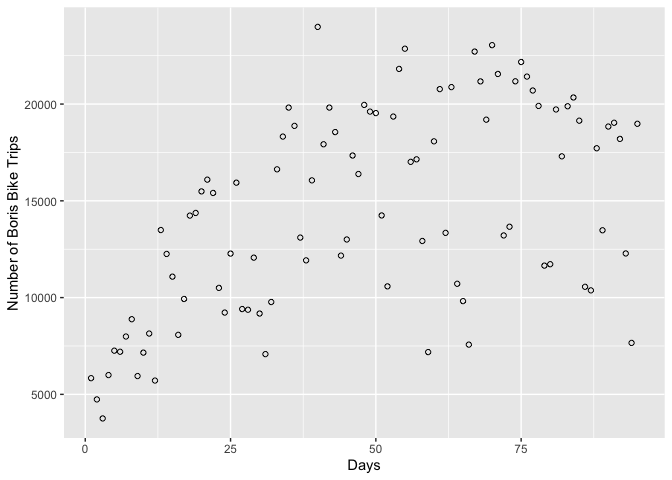
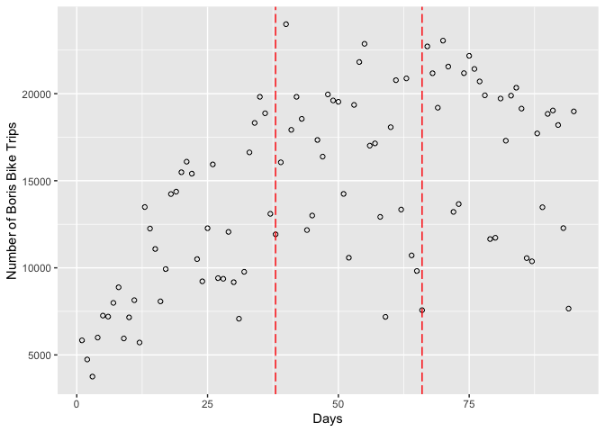
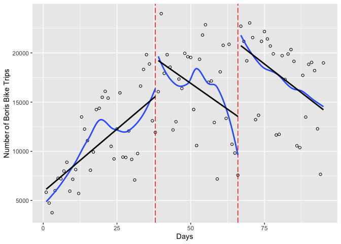

## HKR 6130 Week 8  

## Intervention Evaluation Solutions

### Interrupted Time Series

#### Import the CSV file from online


```r
boris <- read.csv("https://github.com/walkabilly/HKR6130_MUN/raw/master/data/boris_data.csv")

head(boris)
```

```
##   X start_date t_trip strike time
## 1 1  30-Jul-10   5836      0    1
## 2 2  31-Jul-10   4739      0    2
## 3 3  01-Aug-10   3756      0    3
## 4 4  02-Aug-10   5997      0    4
## 5 5  03-Aug-10   7257      0    5
## 6 6  04-Aug-10   7201      0    6
```

#### Understand the data

The data represent bike share program use in London. There were two transit system strikes in London during the time period. The data represent these strikes. The data has a number of variables. Some of which I created in steps that I did not show here. Here is a description of the variables:   
1. **start_date**: The date [Type = Factor]  
3. **t_trip**: The total number of trips that day [Type = Integer]  
4. **strike**: A categorical variable indicating strike 0 (pre), 1 (strike 1), 2 (strike 2) [Type = Numeric]  
5. **time**: A sequence from 1 to 95 [Type = Integer]  

#### Visualize the data

Use the variable **t_trip** as the outcome and create a scatterplot of the data over time. We will need `ggplot2` as per usual. 

```r
library(ggplot2)
boris_f1 <- ggplot(boris, aes(x = time, y = t_trip)) + 
  geom_point(shape = 1) + 
  xlab("Days") +
  ylab("Number of Boris Bike Trips")
```

```r
plot(boris_f1)  
```

<!-- -->

We know the strikes happened on September 6th and October 4th. Add horizontal lines to the figure to shown when the strikes happened. You can use `geom_vline` to create the lines on the figures. 


```r
library(ggplot2)
boris_f2 <- ggplot(boris, aes(x = time, y = t_trip)) + 
  geom_point(shape = 1) + 
  xlab("Days") +
  ylab("Number of Boris Bike Trips") + 
  geom_vline(xintercept = 38, colour = "red", linetype = "longdash") + 
  geom_vline(xintercept = 66, colour = "red", linetype = "longdash")
```


```r
plot(boris_f2)  
```

<!-- -->

Now. Let's use the function `geom_smooth` by group (strike) to get a sense of how the relationship is changing over time. Here will use the default `geom_smooth` which is a *loess* regression. We can also visualize the linear relationship using `"method = "lm"`.


```r
library(ggplot2)
boris_f3 <- ggplot(boris, aes(x = time, y = t_trip)) + 
  geom_point(shape = 1) + 
  xlab("Days") +
  ylab("Number of Boris Bike Trips") + 
  geom_vline(xintercept = 38, colour = "red", linetype = "longdash") + 
  geom_vline(xintercept = 66, colour = "red", linetype = "longdash") + 
  geom_smooth(aes(group = strike), se = FALSE) + 
  geom_smooth(aes(group = strike), method = "lm", se = FALSE, colour = "black")
```


```r
plot(boris_f3)  
```

```
## `geom_smooth()` using method = 'loess' and formula 'y ~ x'
```

```
## `geom_smooth()` using formula 'y ~ x'
```

<!-- -->

Here we see that there a big increases in the number of trips of Boris bikeshare bikes in London during the strike but that over time, the usage goes decreases. We can create a table to show use the number of at each strike period using `dplyr::group_by` and `dplyr::summarize`. Calculate the average and standard deviation during each period (strike variable). 


```r
library(dplyr)
```

```
## 
## Attaching package: 'dplyr'
```

```
## The following objects are masked from 'package:stats':
## 
##     filter, lag
```

```
## The following objects are masked from 'package:base':
## 
##     intersect, setdiff, setequal, union
```

```r
trip_mean <- boris %>% 
  group_by(strike) %>% 
    summarise(m_trip = mean(t_trip),
              sd_trip = sd(t_trip))
head(trip_mean)
```

```
## # A tibble: 3 x 3
##   strike m_trip sd_trip
##    <int>  <dbl>   <dbl>
## 1      0 10856.   4198.
## 2      1 16380.   4557.
## 3      2 17476.   4333.
```

Here we see that the average number of trips before the strike was 10856, after the first stroke the average was 16380, and after the second strike the average was 17476 trips per day. 
