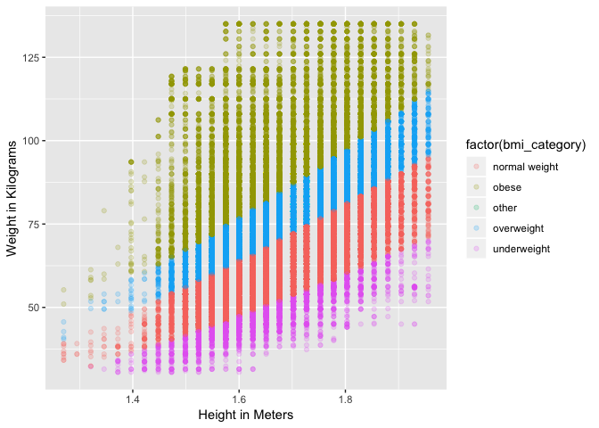

## HKR 6130 Week 2

## Introduction

This week we will introduce R. Your objective is to become familiar with the software and learn some programming. This week will be scary. It will take time. You are learning a new language.  

In my experience the biggest hurdle for people is getting setup in R, reading in a file, and getting familiary with Markdown. Read and become familiar with Markdown. Slow and steady. Run small chunks of code at a time. 

## Objectives

1. Learn R.
2. Reproduce the analysis I've done in this tutorial. 
3. Learn Markdown. 

## Readings

1. [Getting Started with RMarkdown](http://rmarkdown.rstudio.com/lesson-1.html). You need to follow each one of the tabs on the left on the page. 
2. Wickham, H. Tidy Data. Journal of Statistical Software. 2014, 50:10.
 [http://dx.doi.org/10.18637/jss.v059.i10](http://dx.doi.org/10.18637/jss.v059.i10)
3. R coding style sheets: 
    i) [Hadley](http://adv-r.had.co.nz/Style.html) 
    ii) [Goolge](https://google.github.io/styleguide/Rguide.xml) 

## Task - R Tutotial - Assignment 2  
1. Follow the RMarkdown tutorial in point 2 of the readings.  
2. Use the data included in GitHub, `CCHS.csv` [Right click on this link and select save as...](https://github.com/walkabilly/HKR6130_MUN/blob/master/data/cchs.csv?raw=true), to reproduce the analysis presented below in R.  
3. Submit your RMarkdown `.Rmd` file and your rendered Markdown PDF to Brightspace. 

## Notes  

1. I am using the [Teach the tidyverse to beginners](http://varianceexplained.org/r/teach-tidyverse/) philosophy developed by David Robinson. 

2. There is almost always more than one way to do the same thing in R. The tidyverse will be our main approach because it's consisent and powerful.  

## Getting Started in R

The [R project for statistical computing](https://www.r-project.org/) is a free open source statistical programming language and project. Follow these steps to get started:

1. Download and install R from the Dalhousie CRAN (Comprehensive R Archive Network) Mirror <http://mirror.its.dal.ca/cran/>
2. Download and install the Open Source Rstudio Desktop License <https://www.rstudio.com/products/rstudio/download/>. RStudio is a free IDE (Integrated Development Environment) built for R. It makes your life easier! 

#### [Watch a cheezy R Studio video here](https://vimeo.com/97166163)

## Open RStudio

You should see something that looks like in the video. 

* If yes, **great**
* If no, **Email me**.

# What is R? 

R was first written as a research project by Ross Ihaka and Robert Gentleman, and is now under active development by a group of statisticians called 'the R core team'. R is available free of charge and is distributed under the terms of the Free Software Foundation's GNU General Public License. You can download the program from the Comprehensive R Archive Network (CRAN). Ready-to-run 'binaries' are available for Windows, Mac OS X, and Linux. The source code is also available for download and can be compiled for other platforms. [German Rodriguez](http://data.princeton.edu/R/)

# Why use R?

The main advantages of R are the fact that R is freeware and that there is a lot of help available online.

* Strengths  
    + free and open source, supported by a strong user community  
    + highly extensible and flexible  
    + implementation of modern statistical methods  
    + assists with replication and extension of your work
* Weaknesses  
    + slow with very large data sets  
    + non-standard programming paradigms  

# Let's get started

## Calculator

You can use R as a basic calculator. If you pass the command 2+2 it will return 4. 

```r
2+2
```

```
## [1] 4
```

You can use arithmetic and mathematical operators in your commands  

| Code  | Action |
| --- | --- |
| +  | Addition |
| -  | Subtraction |
| *  | Multiplication |
| /  | Division |
| ^  | Raise to the power of |

## Assignment and Variables

You can use the "<-" symbol to assign a variable. This is not a variable in the social science/statistics sense. Think if it as storing something to be used again later. So if we want to store the number *4* and call it *a* we can. Then we ask R to return the value of *a* we get *4*.


```r
a <- 4
a
```

```
## [1] 4
```

With our newly stored *a* we can do calculations.

```r
a*20
```

```
## [1] 80
```

## Functions

We can apply functions to the vector we just created. For example, if we wanted to compute the mean of the vector we could write

```r
(1+2+3+4)/4
```

```
## [1] 2.5
```

That is long and error prone. So we can call a function from Base R named `mean` to do the same thing.

```r
vector <- c(1,2,3,4)
mean(vector)
```

```
## [1] 2.5
```

Within the brackets you specify the `arguments`. Arguments give extra information to the function.

There a lots of pre-existing arguments in R. If you are thinking about it, someone probably already wrote a function for it. Here is a non-exaustive list of mathematical and statistical functions borrowed from [Wagner - BIO360](http://nicolascampione.weebly.com/uploads/1/9/4/1/19411255/r_cheat_sheet.pdf). 

Code  | Action
------------- | -------------
mean(x)  | Average
median(x) | Median
var(x)  | Variance
sd(x)  | Standard Deviation
log(x)   | Logarithm of x
exp(x)   | Exponential function ex
sin(x)   | Sin
cos(x)   | Cosine
tan(x)   | Tangent
min(x)   | Minimum value
max(x)   | Maximum value
sum(x)   | Sum of values
cumsum(x)   | Cummulative sum of values
length(x)   | Length of vector

## Packages/Libraries

R can do many statistical and data analyses. They are organized in so-called packages or libraries. With the standard installation, most common packages are installed. There are lots of packages. It's probable that if you have thought about the analysis, there is a package that is able to do it already. There are two basic steps to using a package: 

  * Installing the package  `install.packages("tidyverse")`
  * Loading the package     `library(tidyverse)`

You can ask for help about a package by typing `?tidyverse` or search the R website by typing `??tidyverse`.

Packages we will need to for this tutorial:  
1. `tidyverse`
2. `ggplot2`
3. `car`
4. `haven`
5. `read_excel`

## Data Frames

Data frames are probably what you are used to working with. This is the typical data format other statistical software, like SPSS and Stata use. In R, are a data frame can be comprised of many different data types (i.e., numeric, string, factor) so long as all variables are the same length. Data frames also typically have labelled headers giving you a short description of the variable. 

# Working with real data

As our example we will be using the Canadian Community Health Survey (CCHS) 2011-2012 data extracted from CHASS at the University of Toronto. The Canadian Community Health Survey (CCHS) is a cross-sectional survey that collects information related to health status, health care utilization and health determinants for the Canadian population. It surveys a large sample of respondents and is designed to provide reliable estimates at the health region level.

## Set a working directory

**Mac**    `setwd("/Users/dfuller/Desktop/")`   
**PC**     `setwd("C:\\Users\\Andrie\\R\\win-library\\")` 
   
You can import pretty much any type of data into R with the `foreign` package. It allows you to import and work with data without owning the software. Once you do that you can also write the data to .csv or another reasonable data format. Some examples: 

Package | Code  | Action
------------- | ------------- | -------------
haven | read.sav  | SPSS data
foreign | read.dta | Stata data
read_excel | readxl | Excel data

You can read many file formats using the `haven` package. 

### Example of `read.csv`

```r
cchs <- read.csv("/Users/dfuller/Dropbox/Teaching/MUN/HKR 6130/2017/HKR6130_MUN/data/cchs.csv")
## Remember to change your file path
```

### Example of `read_sav`

```r
library(haven)

cchs_spss <- read_sav("/Users/dfuller/Dropbox/Teaching/MUN/HKR 6130/2017/HKR6130_MUN/data/cchs.sav")
## Remember to change your file path
```

### Example of `readxl`

```r
library(readxl)

cchs_xl <- read_excel("//Users/dfuller/Dropbox/Teaching/MUN/HKR 6130/2017/HKR6130_MUN/data/cchs.xlsx", col_types = c("numeric", "text", "text", "numeric", "numeric"))
```

Can also write data to many different formats SPSS, Stata, SAS, csv...

### Exploring the Data  

Now we have some data. The variables are as follows: 

* CASEID
    + Unique identifier for each participant
* verdate
    + Date the survey was complete
* geogprv
    + Province 
* hwtghtm
    + Height in Meters
* hwtgwtk
    + Weight in Kilograms

We can also use `head` to get a quick view of the data frame

```r
head(cchs)
```

```
##   CASEID  verdate geogprv hwtghtm hwtgwtk
## 1      1 20130913      35   1.575   65.25
## 2      2 20130913      59   1.905   99.00
## 3      3 20130913      35   1.803   77.40
## 4      4 20130913      46   1.727   85.50
## 5      5 20130913      24   1.803   81.00
## 6      6 20130913      48   1.727   78.75
```

We can also use `tibble` to get a quick view of the data frame

```r
library(tidyverse)
tbl_df(cchs)
```

```
## # A tibble: 124,929 x 5
##    CASEID  verdate geogprv hwtghtm hwtgwtk
##     <int>    <int>   <int>   <dbl>   <dbl>
##  1      1 20130913      35    1.58    65.2
##  2      2 20130913      59    1.90    99  
##  3      3 20130913      35    1.80    77.4
##  4      4 20130913      46    1.73    85.5
##  5      5 20130913      24    1.80    81  
##  6      6 20130913      48    1.73    78.8
##  7      7 20130913      12    1.63    62.1
##  8      8 20130913      48   10.00  1000. 
##  9      9 20130913      35    1.90   106. 
## 10     10 20130913      59    1.85    85.5
## # … with 124,919 more rows
```

We will mostly be working the **Hadley/Rstudio** way to do this. That said, one of the nice/horrific things about R is that there are many many ways to do the same thing.  

Some basic concepts: 

Unlike other stats programs R makes you call the data and variable together. So if I want the `weight` variable from the `cchs` data you can do that a few different ways:
  
  * `cchs$hwtghtm` - Call the data and variable by name using the $ symbol
  * `cchs %>% hwtghtm` - Call the data, a function using the pipe operator
  * Sometimes packages have a `data = ` to call the data and then you can call the varible name at the correct places. This is common in regression type packages.

## Descriptive Statistics

Summarize the entire data frame using `summary`

```r
summary(cchs)
```

```
##      CASEID          verdate            geogprv         hwtghtm     
##  Min.   :     1   Min.   :20130913   Min.   :10.00   Min.   :1.270  
##  1st Qu.: 31233   1st Qu.:20130913   1st Qu.:24.00   1st Qu.:1.600  
##  Median : 62465   Median :20130913   Median :35.00   Median :1.676  
##  Mean   : 62465   Mean   :20130913   Mean   :36.25   Mean   :2.014  
##  3rd Qu.: 93697   3rd Qu.:20130913   3rd Qu.:47.00   3rd Qu.:1.778  
##  Max.   :124929   Max.   :20130913   Max.   :60.00   Max.   :9.999  
##     hwtgwtk       
##  Min.   :  30.60  
##  1st Qu.:  63.00  
##  Median :  74.25  
##  Mean   : 128.04  
##  3rd Qu.:  87.75  
##  Max.   : 999.99
```

Summarize a specific variable using `summary`

```r
summary(cchs$hwtghtm)
```

```
##    Min. 1st Qu.  Median    Mean 3rd Qu.    Max. 
##   1.270   1.600   1.676   2.014   1.778   9.999
```

## Plot the Data

The code here uses `ggplot2` to create a scatter plot. We specify the data, the variables to use on the x and y axes. The we use `geom_point` to create a scatter plot. There are lots of different `geoms` for making different types of plots. We also include `xlab` and `ylab` to give the axes labels. 


```r
library(ggplot2)

scatter <- ggplot(cchs, aes(x = hwtghtm, y = hwtgwtk)) + 
  geom_point() + 
  xlab("Height in Meters") +
  ylab("Weight in Kilograms")
plot(scatter)
```

<!-- -->

We can see the plot looks very strange. Looks like the data are coded in a specific way (SPSS style) for missing data. With 999.96 and 999.99 for weight and 9.996 and 9.999 for height. 

### Missing Values
"The value NA is used to represent missing values for input in R. An NA can be assigned to a variable directly to create a missing value, but to test for missing values, the function is.na must be used.
R propogates missing values throughout computations, so often computations performed on data con- taining missing values will result in more missing values. Some of the basic statistical functions (like mean, min, max, etc.) have an argument called na.rm, which, if set to TRUE, will remove the NAs from your data before calculations are performed. In addition, the statistical modeling functions (like aov, glm, loess, etc.) provide an argument called na.action. This argument can be set to a function which will be called to operate on the data before it is processed. One very useful choice for the na.action argument is na.omit. This function (which can be called idependently of the statistical modelling functions) will remove all the rows of a data frame or matrix which contain any missing values." ([Spector - An introduction to R](http://www.stat.berkeley.edu/~spector/R.pdf))

## Recoding data 

Recoding a values from a continous variable. We use dplyr and the pipe operator. The code does the follow:
    i) Tells R to write the new result to the CCHS data
    ii) Tells R to use the CCHS data for the function
    iii) Uses the `mutate` function to create a new variable called `height_m` and `ifelse` function to replace with 9.996 and 9.999 from `hwtghtm` with `NA`, the missing value specification for R. It also tells R to replace everything else with the existing values of `hwtghtm`.


```r
# Recoding the height data
cchs <- cchs %>%
  mutate(height = ifelse(hwtghtm == 9.996 | hwtghtm == 9.999, NA, hwtghtm))
```

I'm going to print the first 8 rows of the data. We can see that the variables height has been correctly recoded. 


```r
head(cchs, n = 10)
```

```
##    CASEID  verdate geogprv hwtghtm hwtgwtk height
## 1       1 20130913      35   1.575   65.25  1.575
## 2       2 20130913      59   1.905   99.00  1.905
## 3       3 20130913      35   1.803   77.40  1.803
## 4       4 20130913      46   1.727   85.50  1.727
## 5       5 20130913      24   1.803   81.00  1.803
## 6       6 20130913      48   1.727   78.75  1.727
## 7       7 20130913      12   1.626   62.10  1.626
## 8       8 20130913      48   9.999  999.99     NA
## 9       9 20130913      35   1.905  105.75  1.905
## 10     10 20130913      59   1.854   85.50  1.854
```

Now we know we are going to need to clean the weight variable and we are going to want to calculate BMI, BMI category, and give some meaning names to the provinces. We can do that entire process in one chunk of code using the same logic we had before. 


```r
cchs <- cchs %>%
  mutate(weight = ifelse(hwtgwtk == 999.96 | hwtgwtk == 999.99, NA, hwtgwtk),
         bmi = weight/height^2)
```

The mutate method works particularly well when you are using numeric variables. I'm going to fall back on the `car` package recode function. I typically use this instead of `dplyr::recode`.


```r
cchs <- cchs %>%
	mutate(bmi_category = case_when(
		weight < 18.5 ~ "underweight",
		weight >=30 & weight <999 ~ "obese",
		weight >=25 & weight <30 ~ "overweight",
		weight >=18.5 & weight <25 ~ "normal weight",
		TRUE ~ "other"
	))

## Let's also recode geogprv so it makes more sense

cchs <- cchs %>%
	mutate(province = case_when(
		geogprv == 10 ~ "NFLD & LAB",
		geogprv == 11 ~ "PEI",
		geogprv == 12 ~ "NOVA SCOTIA",
		geogprv == 13 ~ "NEW BRUNSWICK",
		geogprv == 24 ~ "QUEBEC",
		geogprv == 35 ~ "ONTARIO",
		geogprv == 46 ~ "MANITOBA",
		geogprv == 47 ~ "SASKATCHEWAN",
		geogprv == 48 ~ "ALBERTA",
		geogprv == 59 ~ "BRITISH COLUMBIA",
		geogprv == 60 ~ "YUKON/NWT/NUNA",
		geogprv == 96 ~ "NOT APPLICABLE",
		geogprv == 97 ~ "DON'T KNOW",
		geogprv == 98 ~ "REFUSAL",
		TRUE ~ "NOT STATED"
	))
```

Let's graph that data again with our cleaned height and weight variables.

```r
library(ggplot2)

scatter_clean <- ggplot(cchs, aes(x = height, y = weight)) + 
  geom_point() + 
  xlab("Height in Meters") +
  ylab("Weight in Kilograms")
plot(scatter_clean)
```

<!-- -->

What if we wanted to see how BMI categories were distributed along with height and weight scatter plot. We can add a colour aesthetic using the `bmi_cat` variable `aes(colour = factor(bmi_cat))` to the `geom_point` command to get colours by BMI category. There are many ways to change the colour scheme but I'm not going into that at the moment.  I also added the `alpha` command, which lightens the points so we can get a better sense of where the data are sparse. 


```r
library(ggplot2)

scatter_cat <- ggplot(cchs, aes(x = height, y = weight)) + 
  geom_point(aes(colour = factor(bmi_category)), alpha = 1/5) + 
  xlab("Height in Meters") +
  ylab("Weight in Kilograms")
plot(scatter_cat)
```

<!-- -->

## Data Wrangling

Here we are going to learn how to collapse, subset, append, and merge data. We are going to hack our cchs data into different pieces and put it all back together. 

A few notes:   
    i)**These are non trivial operations and in my experience people do not do enough due diligence to check and make sure they get what they expect.**
    ii)**Expect that your code will blow up and do weird things.**

### Collapsing by  

Let's say I want to get the mean and SD of BMI for each province. I can do that with `dplyr`.


```r
bmi_prov <- cchs %>%
  group_by(province) %>%
    summarise(mean_BMI = mean(bmi, na.rm=TRUE),
              sd_BMI = sd(bmi, na.rm=TRUE),
              total = n())

bmi_prov
```

```
## # A tibble: 11 x 4
##    province         mean_BMI sd_BMI total
##    <chr>               <dbl>  <dbl> <int>
##  1 ALBERTA              26.3   5.49 11321
##  2 BRITISH COLUMBIA     25.5   4.97 15413
##  3 MANITOBA             26.9   5.68  6962
##  4 NEW BRUNSWICK        27.0   5.66  4786
##  5 NFLD & LAB           27.1   5.43  3625
##  6 NOVA SCOTIA          26.8   5.59  4629
##  7 ONTARIO              26.1   5.34 42915
##  8 PEI                  26.6   5.32  1774
##  9 QUEBEC               25.5   5.03 23260
## 10 SASKATCHEWAN         26.8   5.48  7161
## 11 YUKON/NWT/NUNA       26.4   5.59  3083
```

### Subsetting

Image want to only use the data from Newfoundland. We need a way to select only the newfoundland data. We will use filter to select only the Newfoundland data and create a new dataframe called `newfoundland`.


```r
newfoundland <- cchs %>%
  filter(province == "NFLD & LAB")  

sask <- cchs %>%
  filter(province == "SASKATCHEWAN")   ## Let's do the same thing with Saskatchewan

table(newfoundland$province)
```

```
## 
## NFLD & LAB 
##       3625
```

```r
table(sask$province)
```

```
## 
## SASKATCHEWAN 
##         7161
```

### Appending (stacking data)

Image we want to put the Saskatchewan and Newfoundland data together into one dataframe. Maybe we want to run a t-test to compare Sask and NL. We can do that with with `bind_rows`. Because our data have the same column names and same number of columns this is easy. We will create a new dataframe called `sask_nl`.


```r
sask_nl <- bind_rows(sask, newfoundland)
table(sask_nl$province)
```

```
## 
##   NFLD & LAB SASKATCHEWAN 
##         3625         7161
```

Notes:   
1. The Newfoundland data had 7161 observations and the Saskatchewan data had 3625 observations. We would expect 10786 observations. Ok makes sense.  
2. We expect 11 variables to be in the dataframe because there where 11 in each of the Sask and Newfoundland dataframes.  
3. Had we done this without having a province variable in the dataframe it would not be possible to tell who was from Sask and who was from NL. This can be a huge problem. If you are appending or merging data make sure that you have some kind of index variable that lets you differentiate the datasets. Stata does this particularly well by default.  

### Merging

Now image we have the same data for each participant but the height and weight data in two different dataframes. The varibale `CASEID` is a unique identifier for each person in the 2 dataframes. We want to merge the dataframes so we can have the height and weight data for each person. 

First, let's create the datasets we need using select. We will only focus on the Newfoundland data. 


```r
### Select the height data 
nl_height <- newfoundland %>%
  select(CASEID, height)

### Select the weight data 
nl_weight <- newfoundland %>%
  select(CASEID, weight)
```

There are different ways to join the data. We are only going to cover full joins and inner joins. For full detail about all of the different types of joins you can check Stat545 here [http://stat545.com/bit001_dplyr-cheatsheet.html](http://stat545.com/bit001_dplyr-cheatsheet.html).

#### Full join

Full join includes all of the data that is available in both datasets. Given there are 3625 observations in each dataframe we would expect that there will be 3625 observations in the joined dataframe. 


```r
join_full_nl <- full_join(nl_weight, nl_height, by="CASEID")
head(join_full_nl)
```

```
##   CASEID weight height
## 1     23  87.75  1.753
## 2     70  67.50  1.575
## 3     71 134.10  1.854
## 4     91  78.75  1.829
## 5     99  74.25  1.753
## 6    117  77.85  1.702
```

The most important thing with the join is to ensure that you understand what data are coming from where. This example is straightforward. Let's complicate things a little by removing some rows from the height data and making some values of CASEID missing in the weight data. 


```r
### Select the height data 
nl_height1 <- newfoundland %>%
  select(CASEID, height) %>%
    filter(height < 2)

### Select the weight data 
nl_weight1 <- newfoundland %>%
  select(CASEID, weight) %>%
    filter(CASEID == ifelse(CASEID <= 100, NA, CASEID))
```

Now our new dataframes are as follows:   
1. `nl_height1` is missing 183 observations compared to the full dataframe  
2. `nl_weight1` is missing 5 observations compared to the full dataframe  

#### Inner join

Inner joins retain only the rows in both datasets. In our case, we expect we know that there will be 3437 cases in the new dataframe using an inner join. 


```r
join_inner_nl <- inner_join(nl_weight1, nl_height1, by="CASEID")
head(join_inner_nl)
```

```
##   CASEID weight height
## 1    117  77.85  1.702
## 2    129  67.50  1.651
## 3    162 108.90  1.626
## 4    270  81.00  1.626
## 5    346  90.00  1.803
## 6    386 103.50  1.727
```

```r
nrow(join_inner_nl)
```

```
## [1] 3437
```

Yes! 

#### Full join


```r
join_full_nl_2 <- full_join(nl_weight1, nl_height1, by="CASEID")
nrow(join_full_nl_2)
```

```
## [1] 3625
```

Now if we do the full join we can see we retain all of the data despite there being missing and non complete data in both dataframes we want to merge. 

### Write a file

The last thing we will do is write our newly merge data frame to a csv on our computer. I'm going to write the file to desktop. Make sure you know where your file is going. Also make sure if you are using Windows that you use the correct path structure. 


```r
write.csv(join_full_nl_2, file = "/Users/dfuller/Desktop/join_full_nl_2.csv")
```
