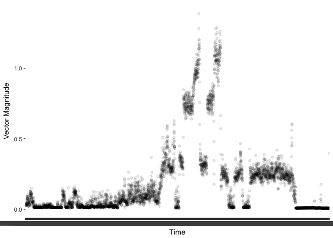
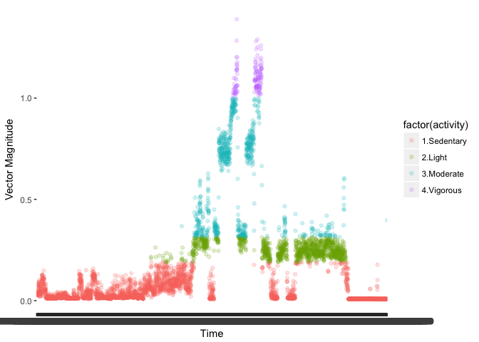
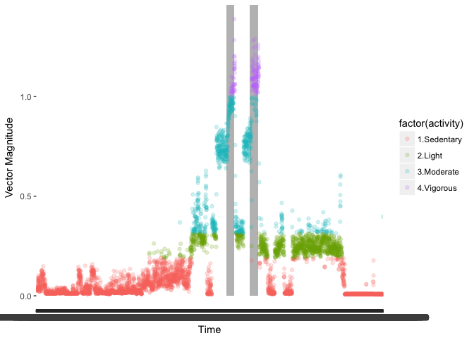

# Week 4
Daniel Fuller  
2017-09-07  


## HKR 6130 Week 4  

## Introduction

This week we will focus on using R to work with data from Geneactiv accelerometers. [Active Insights](https://www.activinsights.com/products/geneactiv/) is the company that makes Geneativ devices, which are research grade accelerometers. Henry and I went for a run this summer to collect some data for this portion of the course. The estimated times and intensities for the run times are.  

| Time Stamp | Activity |
|------------|----------|
| 10:10 | Walk |
| 10:12 | Jog |
| 10:18 | Fast Run |
| 10:20 | Walk |
| 10:22 | Jog |
| 10:24 | Fast Run |
| 10:26 | Walk |
| 10:28 | Stand |
| 10:30 | Walk |
| 10:32 | Sit |
| 10:34 | End |

There are 2 short readings then we will jump into analyzing data. For this assignment, I will provide the output PDF that will have all of the analysis, but I will not provide the code used to create the analysis. There will be nothing new with the code, we have seen a version of everything you will need to do in Week 2, and I will provide lots of hints.  

## Objectives

1. Analyze Geneactiv data using R. 
2. Create physical activity cut points based on the literature. 
3. Use real data. 

## Readings 

1. Esliger, D., Rowlands, A V., Hurst, T L., Michael, C., MURRAY, P.,  ROGER R G. Validation of the GENEA Accelerometer. Medicine & Science in Sports & Exercise. 2011, 43(6): 1085-1093. [www.dx.doi.org/10.1249/MSS.0b013e31820513be](www.dx.doi.org/10.1249/MSS.0b013e31820513be) **Select LWW Journals.**

2. Schaeger, C A.,  Nigg, C R., Hill, J O., Brink, L., Browning, R. Establishing and Evaluating Wrist Cutpoints for the GENEActiv Accelerometer in Youth. Medicine & Science in Sports & Exercise. 2014, 46(4): 826–833. [www.dx.doi.org/10.1249/MSS.0000000000000150](www.dx.doi.org/10.1249/MSS.0000000000000150) **Select LWW Journals.**

## Task - Geneactiv Data - Assignment 5  

1. Down the files from GitHub.  
2. Import the 4 files into R.  
    i) Hint: Use `read.csv`
3. Append (stack) the four files together.
    i) Hint: Use `dplyr::bind_rows`
    ii) Hint: Make sure you have a variable that indicates where the data are from
4. Aggregate the data by second and calculate the gravity subtracted vector magnitude, and the standard deviation for each axis (x, y, z,).   
    i) Hint: The data are at 100Hz (100 per second)  
    ii) Hint: The formula for the gravity subtracted vector magnitude is `sqrt(x^2, y^2, z^2)-1`  
    iii) Hint: Use the `sd` function to calcualte the standard deviation  
    iiii) Hint: Use `dplyr`, `group_by`, and `summarise`    
5. Use the cut points from Reading 1, recode the vector magnitude variable, and create a new variable called `activity`. 
6. Create a figure of the physical activity intensity by time using `ggplot2`

You can find the documentation about the Geneactiv data on there website [https://www.activinsights.com/resources-support/geneactiv/downloads-software/](https://www.activinsights.com/resources-support/geneactiv/downloads-software/).
    
## Output from my analysis

Below is the output from my analysis without the code. I've posted the top `head` of the dataframe or other relevant information so you can check your work and make sure you are on the right track. 

#### 2. Import the files 

There are 4 files. The import process will be the same for each. The csv file has 100 rows of information that we will want to remove. We can use `skip` in `read.csv`. There are also no headers and no variable names in the file. You will need to use `header` and `col.names`. Type `?read.csv` to get the documentation for `read.csv`. 

The first rows for *p1_right hip_038757_2017-08-29 10-55-45.csv* should look like this:   


    

```r
head(p1_hip)
```

```
##                      time x_axis  y_axis  z_axis lux button temp
## 1 2017-08-29 09:30:00:500 0.0100 -0.0217 -1.0131 381      0 31.6
## 2 2017-08-29 09:30:00:510 0.0139 -0.0177 -1.0131 398      0 31.6
## 3 2017-08-29 09:30:00:520 0.0218 -0.0098 -1.0091 414      0 31.6
## 4 2017-08-29 09:30:00:530 0.0377 -0.0376 -1.0131 414      0 31.6
## 5 2017-08-29 09:30:00:540 0.0179 -0.0336 -1.0051 414      0 31.6
## 6 2017-08-29 09:30:00:550 0.0060 -0.0297 -1.0051 398      0 31.6
```

Now we repeat for each file. I'm not doing this with a list but we should. More on this later. 

The first rows for *p1_right wrist_038764_2017-08-29 10-50-05.csv* should look like this:   


    

```r
head(p1_wrist)
```

```
##                      time  x_axis  y_axis  z_axis lux button temp
## 1 2017-08-29 09:30:00:500 -0.9659 -0.0579 -0.4145 138      0 32.7
## 2 2017-08-29 09:30:00:510 -1.0550 -0.0740 -0.4829 138      0 32.7
## 3 2017-08-29 09:30:00:520 -1.1157 -0.0821 -0.4749 156      0 32.7
## 4 2017-08-29 09:30:00:530 -1.1116 -0.1303 -0.3623 156      0 32.7
## 5 2017-08-29 09:30:00:540 -1.0752 -0.1625 -0.4588 138      0 32.7
## 6 2017-08-29 09:30:00:550 -1.0550 -0.0981 -0.5633 156      0 32.7
```

The first rows for *p2_right hip_038758_2017-08-29 10-57-53.csv* should look like this:   


    

```r
head(p2_hip)
```

```
##                      time x_axis  y_axis  z_axis lux button temp
## 1 2017-08-29 09:30:00:500 0.0159  0.0069 -0.9974 202      0 30.3
## 2 2017-08-29 09:30:00:510 0.0079  0.0030 -1.0015 185      0 30.3
## 3 2017-08-29 09:30:00:520 0.0239  0.0030 -1.0015 202      0 30.3
## 4 2017-08-29 09:30:00:530 0.0079  0.0148 -0.9853 202      0 30.3
## 5 2017-08-29 09:30:00:540 0.0119 -0.0010 -0.9893 202      0 30.3
## 6 2017-08-29 09:30:00:550 0.0239 -0.0128 -0.9934 202      0 30.3
```

The first rows for *p2_right wrist_038756_2017-08-29 10-53-45.csv* should look like this:   


    

```r
head(p2_wrist)
```

```
##                      time  x_axis  y_axis  z_axis lux button temp
## 1 2017-08-29 09:30:00:500 -0.6057 -0.6495 -0.4931  49      0 32.7
## 2 2017-08-29 09:30:00:510 -0.6097 -0.6375 -0.4931  49      0 32.7
## 3 2017-08-29 09:30:00:520 -0.6057 -0.6334 -0.4972  49      0 32.7
## 4 2017-08-29 09:30:00:530 -0.6176 -0.6294 -0.5094  49      0 32.7
## 5 2017-08-29 09:30:00:540 -0.6097 -0.6495 -0.5094  49      0 32.7
## 6 2017-08-29 09:30:00:550 -0.6057 -0.6415 -0.5094  49      0 32.7
```

#### 3. Append (stack) the four files together

Before we stack the data we want to make sure we know that there is a variable that indicates the participant and the wear location. That information is not currently in the dataframe. To do this we can use `dplyr::mutate`. We will create 2 new variables. One called `id` to indicate the participant and one called `wear_loc` to indicate the wear location. 


Great. Our updated files for P1 look like this now.

Hip:  


```r
head(p1_hip)
```

```
##                      time x_axis  y_axis  z_axis lux button temp id
## 1 2017-08-29 09:30:00:500 0.0100 -0.0217 -1.0131 381      0 31.6 P1
## 2 2017-08-29 09:30:00:510 0.0139 -0.0177 -1.0131 398      0 31.6 P1
## 3 2017-08-29 09:30:00:520 0.0218 -0.0098 -1.0091 414      0 31.6 P1
## 4 2017-08-29 09:30:00:530 0.0377 -0.0376 -1.0131 414      0 31.6 P1
## 5 2017-08-29 09:30:00:540 0.0179 -0.0336 -1.0051 414      0 31.6 P1
## 6 2017-08-29 09:30:00:550 0.0060 -0.0297 -1.0051 398      0 31.6 P1
##   wear_loc
## 1      hip
## 2      hip
## 3      hip
## 4      hip
## 5      hip
## 6      hip
```

Wrist:  

```r
head(p1_wrist)
```

```
##                      time  x_axis  y_axis  z_axis lux button temp id
## 1 2017-08-29 09:30:00:500 -0.9659 -0.0579 -0.4145 138      0 32.7 P1
## 2 2017-08-29 09:30:00:510 -1.0550 -0.0740 -0.4829 138      0 32.7 P1
## 3 2017-08-29 09:30:00:520 -1.1157 -0.0821 -0.4749 156      0 32.7 P1
## 4 2017-08-29 09:30:00:530 -1.1116 -0.1303 -0.3623 156      0 32.7 P1
## 5 2017-08-29 09:30:00:540 -1.0752 -0.1625 -0.4588 138      0 32.7 P1
## 6 2017-08-29 09:30:00:550 -1.0550 -0.0981 -0.5633 156      0 32.7 P1
##   wear_loc
## 1    wrist
## 2    wrist
## 3    wrist
## 4    wrist
## 5    wrist
## 6    wrist
```

Now we can append (stack) the data together. 

```
## Warning in bind_rows_(x, .id): Unequal factor levels: coercing to character
```

```
## Warning in bind_rows_(x, .id): binding character and factor vector,
## coercing into character vector

## Warning in bind_rows_(x, .id): binding character and factor vector,
## coercing into character vector

## Warning in bind_rows_(x, .id): binding character and factor vector,
## coercing into character vector

## Warning in bind_rows_(x, .id): binding character and factor vector,
## coercing into character vector
```

The warning is telling us we are trying to combine character and factors. That's ok. The data was coerced and appended together.


```r
head(accel_data)
```

```
##                      time x_axis  y_axis  z_axis lux button temp id
## 1 2017-08-29 09:30:00:500 0.0100 -0.0217 -1.0131 381      0 31.6 P1
## 2 2017-08-29 09:30:00:510 0.0139 -0.0177 -1.0131 398      0 31.6 P1
## 3 2017-08-29 09:30:00:520 0.0218 -0.0098 -1.0091 414      0 31.6 P1
## 4 2017-08-29 09:30:00:530 0.0377 -0.0376 -1.0131 414      0 31.6 P1
## 5 2017-08-29 09:30:00:540 0.0179 -0.0336 -1.0051 414      0 31.6 P1
## 6 2017-08-29 09:30:00:550 0.0060 -0.0297 -1.0051 398      0 31.6 P1
##   wear_loc
## 1      hip
## 2      hip
## 3      hip
## 4      hip
## 5      hip
## 6      hip
```

Quick gut check. Our previous dataframes had p1_hip = 511500, p1_wrist = 467700, p2_hip = 525900, p2_wrist = 500400. If we add those together we should get 2005500 = 2005500. Excellent.

I did that using inline code in RMarkdown. Looks like this:  

*Quick gut check. Our previous dataframes had p1_hip = 511500, p1_wrist = 467700, p2_hip # = r nrow(p2_hip)`, p2_wrist = 500400. If we add those together we should get  = 2005500.*

#### 4. Aggregate the data by second and calculate the gravity subtracted vector magnitude, and the standard deviation for each axis (x, y, z,). 

Now we need to work a bit with time data. Time data can be scary. Use the package `luridate` to help. The `time` variable is currently a factor. We don't want that. Ok, this part is hard. I'm including the code below. Take a look at the lubridate documentation and make sure you understand what is happening. 

Geneactiv makes a list that is 100milliseconds long then uses that for aggregatation. The problem with that is the aggregation happens at the 0.5 second mark rather than the one second mark. This makes the data challenging to combine with GPS data, which we will be going later. I'm going to show you how to write this two ways. First, a way to replicated the Geneactive data. Second, a way to aggregate by the second.

**Geneactiv Method**  

```r
leng <- nrow(accel_data)/100
accel_data$milli <- rep(seq(1:leng), each=100)
```

**Proper Method**  

```r
library(lubridate)
library(stringr)

accel_data$time1 <- str_sub(accel_data$time, 1, str_length(accel_data$time)-4)  ## Remove the milliseconds
accel_data$time2 <- ymd_hms(accel_data$time1)  ## Create a POSIXct formated variable
accel_data$hour <- hour(accel_data$time2)  ## Create an hour variable
accel_data$minute <- minute(accel_data$time2)  ## Create a minute variable
accel_data$second <- second(accel_data$time2)  ## Create a second variable
```

Here we need to create the vector magnitude variables. You are going to create 2 vector magnitude variables. The `x_axis`, `y_axis`, `z_axis` variables are measured in **g**. So we will create two new variables:    
* Vector Magnitude: `sqrt(accel_data$x_axis^2+accel_data$y_axis^2+accel_data$z_axis^2)`
* Gravity subtracted vector magnitude: `sqrt(accel_data$x_axis^2+accel_data$y_axis^2+accel_data$z_axis^2)-1`  


No we will aggregate and create the new variables at the same time. We will use `dplyr`, `group_by`, and `summarise`, just like we did in week 2, except in week 2 used `mutate` rather than `summarise`. We will need to create the summarized variables. Make sure that you include the `abs()` function in your summary in the gravity substracted vector magnitude variable. 

Note that I'm using `glimpse` instead of `head` because there are too many variables and I want a quick view of them all. 

**Geneactiv Method**  


```r
glimpse(accel_sec_genea)
```

```
## Observations: 20,055
## Variables: 12
## $ milli     <int> 1, 2, 3, 4, 5, 6, 7, 8, 9, 10, 11, 12, 13, 14, 15, 1...
## $ time      <chr> "2017-08-29 09:30:00:500", "2017-08-29 09:30:01:500"...
## $ id        <chr> "P1", "P1", "P1", "P1", "P1", "P1", "P1", "P1", "P1"...
## $ wear_loc  <chr> "hip", "hip", "hip", "hip", "hip", "hip", "hip", "hi...
## $ m_x_axis  <dbl> 0.022196, 0.020494, 0.021442, 0.020218, 0.021446, 0....
## $ m_y_axis  <dbl> -0.034350, -0.034621, -0.034263, -0.034900, -0.03383...
## $ m_z_axis  <dbl> -1.00474, -1.00406, -1.00434, -1.00410, -1.00418, -1...
## $ vec_mag   <dbl> 100.5635, 100.4927, 100.5210, 100.4977, 100.5044, 10...
## $ vec_mag_g <dbl> 0.7686551, 0.7443477, 0.7521750, 0.7466425, 0.855205...
## $ sd_x_axis <dbl> 0.008121028, 0.007577729, 0.007769432, 0.008493258, ...
## $ sd_y_axis <dbl> 0.007909239, 0.008273339, 0.007395653, 0.007960661, ...
## $ sd_z_axis <dbl> 0.007327160, 0.007598405, 0.007427930, 0.007507572, ...
```

**Proper Method**  


```r
glimpse(accel_sec)
```

```
## Observations: 5,260
## Variables: 14
## $ hour      <int> 9, 9, 9, 9, 9, 9, 9, 9, 9, 9, 9, 9, 9, 9, 9, 9, 9, 9...
## $ minute    <int> 30, 30, 30, 30, 30, 30, 30, 30, 30, 30, 30, 30, 30, ...
## $ second    <dbl> 0, 1, 2, 3, 4, 5, 6, 7, 8, 9, 10, 11, 12, 13, 14, 15...
## $ time      <chr> "2017-08-29 09:30:00:500", "2017-08-29 09:30:01:000"...
## $ id        <chr> "P1", "P1", "P1", "P1", "P1", "P1", "P1", "P1", "P1"...
## $ wear_loc  <chr> "hip", "hip", "hip", "hip", "hip", "hip", "hip", "hi...
## $ m_x_axis  <dbl> -0.3758140, -0.3792790, -0.3205540, -0.3671072, -0.3...
## $ m_y_axis  <dbl> -0.16002550, -0.18829300, -0.16573050, -0.14475675, ...
## $ m_z_axis  <dbl> -0.7537920, -0.7204538, -0.8116322, -0.7498365, -0.7...
## $ vec_mag   <dbl> 1.021861, 1.011905, 1.013857, 1.012937, 1.009843, 1....
## $ vec_mag_g <dbl> 0.04965186, 0.03014240, 0.02975791, 0.03137269, 0.04...
## $ sd_x_axis <dbl> 0.4196716, 0.4177310, 0.3458318, 0.4014946, 0.419936...
## $ sd_y_axis <dbl> 0.2825844, 0.2654521, 0.2770485, 0.2950564, 0.289039...
## $ sd_z_axis <dbl> 0.2536057, 0.2910644, 0.2143279, 0.2537107, 0.286560...
```


```r
summary(accel_sec)
```

```
##       hour            minute          second          time          
##  Min.   : 9.000   Min.   : 0.00   Min.   : 0.00   Length:5260       
##  1st Qu.: 9.000   1st Qu.:21.00   1st Qu.:14.00   Class :character  
##  Median :10.000   Median :36.00   Median :29.00   Mode  :character  
##  Mean   : 9.658   Mean   :33.87   Mean   :29.42                     
##  3rd Qu.:10.000   3rd Qu.:47.00   3rd Qu.:44.00                     
##  Max.   :10.000   Max.   :59.00   Max.   :59.00                     
##       id              wear_loc            m_x_axis      
##  Length:5260        Length:5260        Min.   :-0.6989  
##  Class :character   Class :character   1st Qu.:-0.3668  
##  Mode  :character   Mode  :character   Median :-0.2734  
##                                        Mean   :-0.2535  
##                                        3rd Qu.:-0.1633  
##                                        Max.   : 0.3388  
##     m_y_axis           m_z_axis            vec_mag      
##  Min.   :-0.76976   Min.   :-0.998147   Min.   :0.9682  
##  1st Qu.:-0.03757   1st Qu.:-0.792081   1st Qu.:1.0072  
##  Median : 0.11291   Median :-0.426600   Median :1.0279  
##  Mean   : 0.16760   Mean   :-0.417944   Mean   :1.1040  
##  3rd Qu.: 0.36450   3rd Qu.: 0.004501   3rd Qu.:1.1034  
##  Max.   : 0.74857   Max.   : 0.380420   Max.   :2.1669  
##    vec_mag_g          sd_x_axis          sd_y_axis      
##  Min.   :0.006641   Min.   :0.006295   Min.   :0.00599  
##  1st Qu.:0.015701   1st Qu.:0.357276   1st Qu.:0.17818  
##  Median :0.081440   Median :0.488478   Median :0.40699  
##  Mean   :0.191145   Mean   :0.593408   Mean   :0.39369  
##  3rd Qu.:0.257820   3rd Qu.:0.760300   3rd Qu.:0.55105  
##  Max.   :1.389333   Max.   :2.046297   Max.   :1.31686  
##    sd_z_axis       
##  Min.   :0.007292  
##  1st Qu.:0.223262  
##  Median :0.325609  
##  Mean   :0.369814  
##  3rd Qu.:0.468324  
##  Max.   :1.261156
```

#### 5. Use the cut points from Reading 1, recode the vector magnitude variable, and create a new variable called `activity`. 

The cut points in Table 3 from the paper are as follows: 

| Activity | Cut Point (vec_mag_g) | 
|----------|-----------|
| Sedentary | <= 0.19000 |
| Light | >0.19001 to <0.31400 |
| Moderate | >=0.314001 to <0.9989 | 
| Vigorous | >0.999 to max |

We will use the `car::recode` function here. If you want you can try with `dplyr.` We will be using the "accel_sec" data. 


```
## 
## 1.Sedentary     2.Light  3.Moderate  4.Vigorous 
##        3290        1131         707         132
```

#### 6. Create a figure of the physical activity (`vec_mag_g`) intensity by time using `ggplot2`


```r
library(ggplot2)

fig1 <- ggplot(accel_sec, aes(x = time, y = vec_mag_g)) + 
          geom_point(alpha = 1/10) + 
            xlab("Time") +
            ylab("Vector Magnitude")
plot(fig1)
```

<!-- -->

Now we will create a figure that colours the Vector Magnitude by our activity cut point classification.

<!-- -->

#### 7. Just for fun and only if you want I've coloured the approximate times of our vigorous activity with the time stamps. 

<!-- -->

Awesome. Looks about right. I was probably off by a few seconds in the recording but overall not too bad. 

## You just processed 2 Million accelerometer records! Well done. 

  

[Dog](https://media.giphy.com/media/vzO0Vc8b2VBLi/giphy.gif)  

