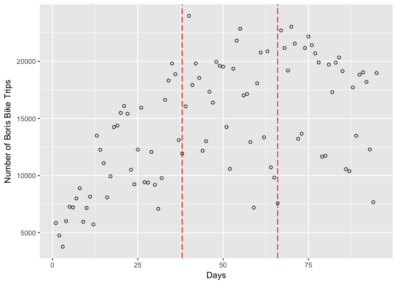

# Week5
Daniel Fuller  


## HKR 6130 Week 5  

## Introduction

This week we will focus on how to use figures and basic statistics for evaluating whether we think an intervention was succesfull. There are many statistical approaches for intervention evaluation that we will not be covering. This is really more of a gut check than an true evaluation. This course will be a test run given this is the first time this course is being run. I'm happy to include more of the statistical approaches, but also understand that this course is already challenging because we are simultaneously learning code and intervention concepts. Feedback welcome. 

If you are interested in statistical approaches for evaluating natural experiments I recommend you check out some tutorials in R avaialble here [http://walkabilly.ca/home/presentations/workshops/](http://walkabilly.ca/home/presentations/workshops/). Select the **DiD and Int Time Series** tab. These tutorials reproduce published analyses using **Difference in Differences** and **Interrupted Time Series** methods. 

## Objectives

1. Use figures and basic statistics to examine whether an intervention was successfull. 
2. Learn about types of figures and apply them to our data. 

## Readings 

1. Cousens S, Hargreaves J, Bonell C, Armstrong B, Thomas J, Kirkwood BR, et al. Alternatives to randomisation in the evaluation of public-health interventions: statistical analysis and causal inference. Journal of Epidemiology & Community Health 2011;65:576–81. [http://dx.doi.org/10.1136/jech.2008.082610](http://dx.doi.org/10.1136/jech.2008.082610)

2. Rousselet G A, Pernet C R, Wilcox R R. Beyond differences in means: robust graphical methods to compare two groups in neuroscience. Eur J Neurosci. 2017;46(2):1738-1748. [https://doi.org/10.1111/ejn.13610](https://doi.org/10.1111/ejn.13610)

## Tasks

We will have 3 main tasks today. This will involving creating 3 different figures using real data. This will be a good start to creating figures for you *n of 1* study. 

### Interrupted Time Series

These data are from a paper I published a while back:  
1. Fuller D, Sahlqvist S, Cummins S, Ogilvie D. The impact of public transportation strikes on use of a bicycle share program in London: Interrupted time series design. Preventive Medicine. 2011;54(1):74–76.[https://doi.org/10.1016/j.ypmed.2011.09.021](https://doi.org/10.1016/j.ypmed.2011.09.021)

#### Import the CSV file from online


```r
boris <- read.csv("https://github.com/walkabilly/HKR6130_MUN/raw/master/boris_data.csv")

head(boris)
```

```
##   X start_date t_trip strike time
## 1 1  30-Jul-10   5836      0    1
## 2 2  31-Jul-10   4739      0    2
## 3 3  01-Aug-10   3756      0    3
## 4 4  02-Aug-10   5997      0    4
## 5 5  03-Aug-10   7257      0    5
## 6 6  04-Aug-10   7201      0    6
```

#### Understand the data

The data represent bike share program use in London. There were two transit system strikes in London during the time period. The data represent these strikes. The data has a number of variables. Some of which I created in steps that I did not show here. Here is a description of the variables:   
1. **start_date**: The date [Type = Factor]  
3. **t_trip**: The total number of trips that day [Type = Integer]  
4. **strike**: A categorical variable indicating strike 0 (pre), 1 (strike 1), 2 (strike 2) [Type = Numeric]  
5. **time**: A sequence from 1 to 95 [Type = Integer]  

#### Visualize the data

Use the variable **t_trip** as the outcome and create a scatterplot of the data over time. We will need `ggplot2` as per usual. 


```r
plot(boris_f1)  
```

<!-- -->

We know the strikes happened on September 6th and October 4th. Add horizontal lines to the figure to shown when the strikes happened. You can use `geom_vline` to create the lines on the figures. 


```r
plot(boris_f2)  
```

<!-- -->

Now. Let's use the function `geom_smooth` by group (strike) to get a sense of how the relationship is changing over time. Here will use the default `geom_smooth` which is a *loess* regression. We can also visualize the linear relationship using `"method = "lm"`.


```r
plot(boris_f3)  
```

```
## `geom_smooth()` using method = 'loess'
```

<!-- -->

Here we see that there a big increases in the number of trips of Boris bikeshare bikes in London during the strike but that over time, the usage goes decreases. We can create a table to show use the number of at each strike period using `dplyr::group_by` and `dplyr::summarize`. Calculate the average and standard deviation during each period (strike variable). 


```
## # A tibble: 3 x 3
##   strike   m_trip  sd_trip
##    <int>    <dbl>    <dbl>
## 1      0 10855.79 4198.072
## 2      1 16379.82 4556.545
## 3      2 17476.21 4332.697
```

Here we see that the average number of trips before the strike was 10856, after the first stroke the average was 16380, and after the second strike the average was 17476 trips per day. 
