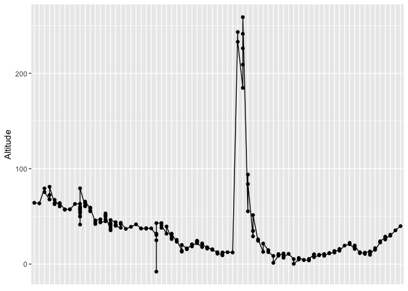
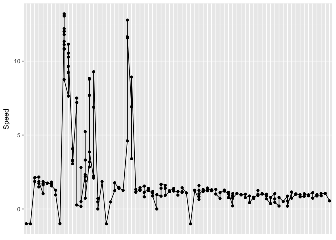
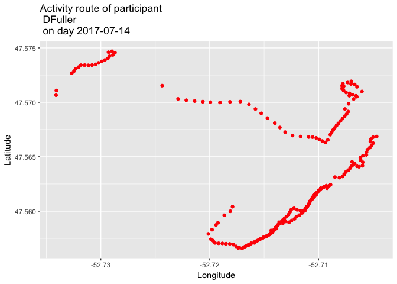
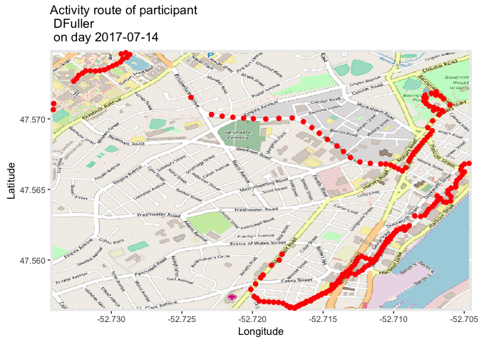
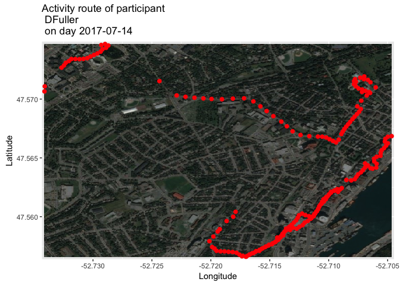
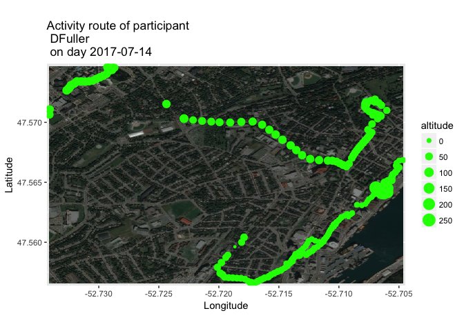
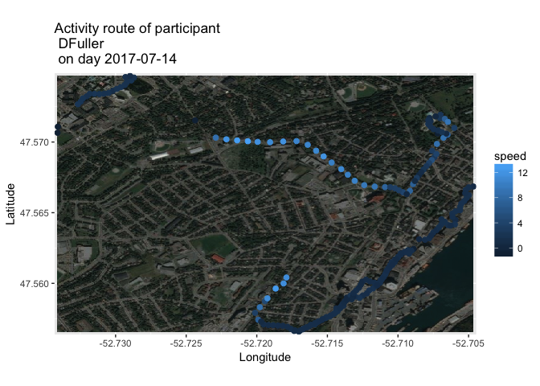

# Week 8: Getting started with GPS data
Henry Luan  


## HKR 6130 Week 8

## Introduction
This week we will use R to manipulate the GPS data, including plotting the speed and altitude at each GPS point, visualizing daily GPS routes with and without a map background, and calculating the distance travelled in space.

## Objectives

1.	Learn R packages to analyze GPS data
2.	Reproduce the work I've done in this tutorial. 

## Readings
1. Jankowska, M. M., Schipperijn, J., & Kerr, J. (2015). A Framework For Using GPS Data In Physical Activity And Sedentary Behavior Studies. Excercise and Sport Sciences Reviews, 43(1), 48-56. [https://www.ncbi.nlm.nih.gov/pmc/articles/PMC4272622/](https://www.ncbi.nlm.nih.gov/pmc/articles/PMC4272622/)

2. Maddison, R., & Mhurchu, C. N. (2009). Global positioning system : a new opportunity in physical activity measurement, 8, 1-8. [https://ijbnpa.biomedcentral.com/articles/10.1186/1479-5868-6-73](https://ijbnpa.biomedcentral.com/articles/10.1186/1479-5868-6-73)

## Assignment 

1. Use the data included in GitHub, coordinates.csv, to reproduce the analysis presented below in R.
2. Submit your RMarkdown .Rmd file and your rendered Markdown PDF to Brightspace.

## Getting started

#### Description of the dataset
This dataset includes the 6136 GPS records of 1 participant, and includes 14 variables:   
1. uuid (the unique id of the participant)  
2. id (unique id of a GPS record)
3. latitude  
4. longitude   
5. altitude (meters)
6. speed (meters per second)
7. direction  
8. h_accuracy  
9. v_accuracy  
10. acceleration_x   
11. acceleration_y  
12. acceleration_z   
13. mode_detected  
14. timestamp (the time when the GPS data was recorded).  

#### Set the working directory and read GPS data from the .csv file. Note that we alphabetically order the GPS records based on participants' unique id.

```r
gps <- read.csv("gps_user1.csv")
gps <- gps[order(gps$uuid),]
head(gps)
```

```
##      X                                 uuid      id latitude longitude
## 1 4300 88C6D155-9D4A-4896-9FC9-ADB50B764991 5037695 47.57066 -52.73411
## 2 4301 88C6D155-9D4A-4896-9FC9-ADB50B764991 5128607 47.57108 -52.73409
## 3 4302 88C6D155-9D4A-4896-9FC9-ADB50B764991 5128605 47.57287 -52.73246
## 4 4303 88C6D155-9D4A-4896-9FC9-ADB50B764991 5128606 47.57267 -52.73267
## 5 4304 88C6D155-9D4A-4896-9FC9-ADB50B764991 5128601 47.57341 -52.73149
## 6 4305 88C6D155-9D4A-4896-9FC9-ADB50B764991 5128602 47.57341 -52.73183
##   altitude speed direction h_accuracy v_accuracy acceleration_x
## 1 64.19975 -1.00        NA         65         10              0
## 2 63.63450 -1.00        NA         65         10              0
## 3 79.33911  1.86        NA          5          6              0
## 4 75.50244  2.12        NA         10         16              0
## 5 67.74653  2.16        NA          5          3              0
## 6 67.78539  1.73        NA          5          3              0
##   acceleration_y acceleration_z mode_detected        timestamp timestamp2
## 1              0              0            NA 2017-07-14 10:30 2017-07-14
## 2              0              0            NA 2017-07-14 11:29 2017-07-14
## 3              0              0            NA 2017-07-14 16:26 2017-07-14
## 4              0              0            NA 2017-07-14 16:26 2017-07-14
## 5              0              0            NA 2017-07-14 16:27 2017-07-14
## 6              0              0            NA 2017-07-14 16:27 2017-07-14
```

#### Add a new variable, `timestamp2`, to the dataset. This variable shows only the date (without specific time) when the GPS data were recorded. 

```r
gps$timestamp2 <- as.Date(as.factor(gps$timestamp))
```

#### Get the unique participants in the data

```r
users <- unique(gps$uuid)
table(users)
```

```
## users
## 88C6D155-9D4A-4896-9FC9-ADB50B764991 
##                                    1
```

#### We explore the activities of the first participant on day 2017-07-14. user_ij is the subset for extracted from the original dataset.

```r
library(dplyr)
day_1 <- "2017-07-14"
user <- "DFuller"
user_ij <- filter(gps, gps$timestamp2 == day_1)
```

Note what Henry did here. He created a vector called `day_1` that is equal to the day he wanted to keep in the filter. Then in the `filter` command, he used `day_1`. The same thing could be done with `c("2017-07-14")`. 

#### plot the altitude record.

```r
library(ggplot2)

ggplot(data = user_ij, aes(x = timestamp, y = altitude))+
  geom_point()+
  geom_line(aes(group = 1)) +
  theme(axis.ticks.x = element_blank(),
        axis.text.x = element_blank(),
        axis.title.x = element_blank()) +
  labs(y="Altitude")
```

<!-- -->

#### Plot the speed at each GPS location: 

```r
ggplot(data = user_ij,aes(x = timestamp, y = speed))+
  geom_point()+
  geom_line(aes(group = 1))+
  theme(axis.ticks.x = element_blank(),
        axis.text.x = element_blank(),
        axis.title.x = element_blank())+
  labs(y="Speed")
```

<!-- -->

#### Plot the GPS points without a map background

```r
title = paste("Activity route of participant\n", as.character(user), "\n", "on day", day_1, sep=" ")
ggplot()+
  geom_point(data = user_ij, aes(x = longitude, y = latitude), size=1.5, color="red")+
  labs(title = title, x = "Longitude", y = "Latitude")
```

<!-- -->

Here there is a title being created before the figure. Then instead of putting the title in the `title = ` line, we just put in title refering to our other title.

#### Plot the GPS points with a map background. 

Note that the function ggplot() is replaced with autoplot(), a function that used for plotting maps. You need to install the package OpenStreetMap if you have not used it before, with the code: 

`install.packages("OpenStreetMap",dependencies = T)`


```r
library(OpenStreetMap)

base_map <- openmap(c(max(user_ij$latitude), min(user_ij$longitude)), 
                    c(min(user_ij$latitude), max(user_ij$longitude)), type = "osm")

### This part is magic. One of the challenges with creating basemaps in R is that it does not have default method for knowing where to put the map. What we did here was use the maximum and minimum of the longitude and latitude to create the bounds for the base map. We now have a programmed method to created bounds for any basemap. 

mapLatLon <- openproj(base_map)

#### Here we are changing the projection of the map. 

autoplot(mapLatLon) +
  geom_point(data = user_ij, aes(x = longitude, y = latitude), size = 2,color = "red") +
  labs(title = title, x = "Longitude", y = "Latitude")
```

<!-- -->

#### We can also use the Bing map with an Aerial image map. 

```r
base_map_bing <- openmap(c(max(user_ij$latitude), min(user_ij$longitude)), 
                         c(min(user_ij$latitude), max(user_ij$longitude)), type = "bing")

mapLatLon_bing <- openproj(base_map_bing)

autoplot(mapLatLon_bing) +
  geom_point(data = user_ij, aes(x = longitude, y = latitude), size = 2, color = "red")+
  labs(title = title, x = "Longitude", y = "Latitude")
```

<!-- -->

#### Change the size of GPS points based on the altitude

```r
autoplot(mapLatLon_bing) +
  geom_point(data = user_ij, aes(x = longitude,y = latitude, size = altitude), color = "green") +
  labs(title = title, x = "Longitude", y = "Latitude")
```

<!-- -->

#### Change the color of GPS points based on the speed

```r
autoplot(mapLatLon_bing)+
  geom_point(data = user_ij, aes(x = longitude, y = latitude, color = speed), size=2) +
  labs(title = title, x ="Longitude", y = "Latitude")
```

<!-- -->

Here the speed is in meters per second. If you want to convert, you could create a new variable and calculate speed in kilometers per hour.

#### Caculate the distance the participant moved in space on day 2017-07-14.  

Note that the following code calculate the distance between the start and end GPS points in space, not necessarily the distance the participant travelled, which requires more complicated calculation by iterating the calculation between GPS points. 


```r
library(raster)
pointDistance(c(user_ij$latitude[1], user_ij$longitude[1]), 
              c(user_ij$latitude[length(user_ij$id)], user_ij$longitude[length(user_ij$id)]), lonlat = T)
```

```
## [1] 1841.787
```

