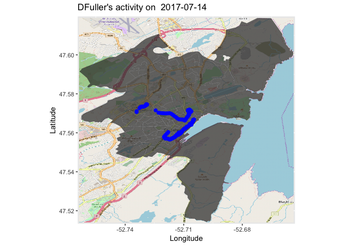
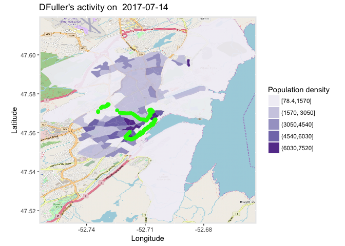
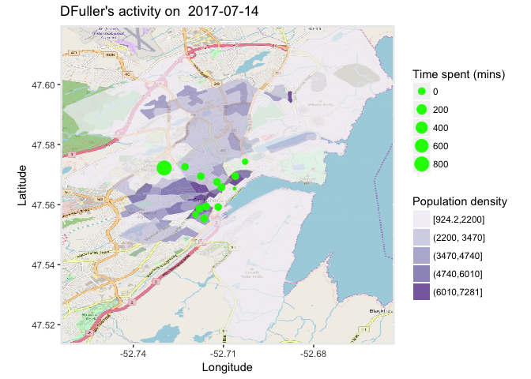
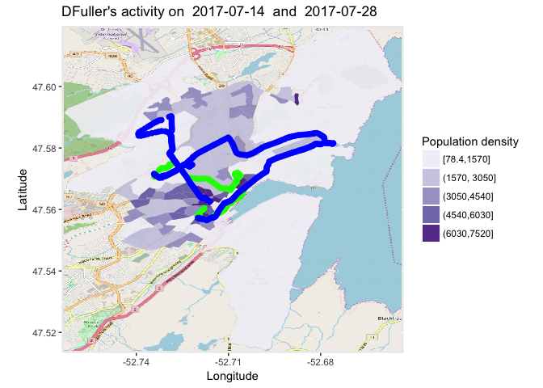
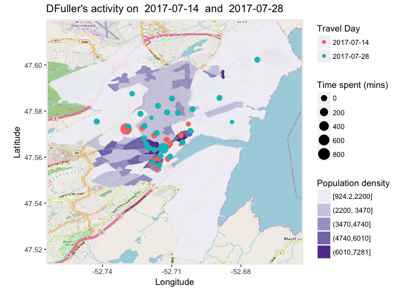
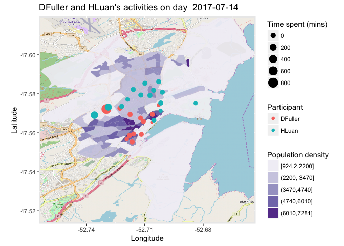

# Week 9: Advanced GPS data visualization and analyses
Henry Luan  
2017-10-23  


## HKR 6130 Week 9

## Introduction
This week we will use R to perform more advanced visualization and analyses of GPS data, including: (1) add a adminstrative map layer, the Dissemination Area (DA) boundaries of St. Johns, to the base map. DAs are the smallest census units in Canada, with a total population 400-700; (2) making a choropleth map (for the DA layer) with the indicator Population Density; (3) calculate and visualize the time of a participant spent in a DA during a specific day; (4) compare the activities of a single participant between two different days; (5) compare the activities of two participants within the same day.

## Objectives

1.	Learn to perform advanced visualization and analyses of GPS data. 
2.	Reproduce the work I've done in this tutorial. 

## Assignment 

1. Use the data included in GitHub, coordinates.csv, to reproduce the analysis presented below in R.
2. Submit your RMarkdown .Rmd file and your rendered Markdown PDF to Brightspace.

## Getting started

#### 1. Set the working directory and read GPS data from the .csv file. Note that we alphabetically order the GPS records based on participants' unique id.

```r
#setwd("https://github.com/walkabilly/HKR6130_MUN/blob/master/coordinates.csv")
gps <- read.csv("coordinates.csv")
gps <- gps[order(gps$uuid),]
```

#### 2. Add a new variable, timestamp2, to the dataset. This variable shows only the date (without specific time) when the GPS data were recorded. 

```r
gps$timestamp2 <- as.Date(as.factor(gps$timestamp))
```

#### 3. Get the unique participants in the data

```r
users = unique(gps$uuid)
```

#### 4. First, We explore the activities of the first participant on day 2017-07-14. user_ij is the subset extracted from the original dataset.

```r
library(dplyr)
day1 = "2017-07-14"
user = users[2]
user_ij <- filter(gps, gps$timestamp2 == day1 & gps$uuid==user)
user_ij <- user_ij[order(user_ij$id),]
```

#### 5. Add a polygon shapefile to the base map, along with GPS points

```r
library(OpenStreetMap)
library(rgdal)
library(ggplot2)

title = paste("DFuller's activity on ",day1)

# Read the map layer from your working directory. We also set the projection system
# The function is from the R package "rgdal". Install it if you have not done so yet. 
# Note that pa_shp is a SpatialPolygonDataFrame

pa_shp <- readOGR("DA_LAYER.shp", "DA_LAYER") %>% spTransform(CRS("+proj=longlat +datum=WGS84"))
```

```
## OGR data source with driver: ESRI Shapefile 
## Source: "DA_LAYER.shp", layer: "DA_LAYER"
## with 87 features
## It has 21 fields
```

```r
# Create the base_map. Note that here we set the boundary box of the OpenStreetMap using the top left and lower right points of the DA boundary. 

base_map <- openmap(c(pa_shp@bbox[2,2],pa_shp@bbox[1,1]),c(pa_shp@bbox[2,1],pa_shp@bbox[1,2]),type = "osm")
mapLatLon <- openproj(base_map)

# Plot DA boundary with geom_polygon from ggplot

autoplot(mapLatLon)+
  labs(title=title,x="Longitude",y="Latitude")+
  geom_polygon(data = pa_shp, aes(x = long, y = lat, group = group),alpha=0.7)+
  geom_point(data = user_ij, aes(x=user_ij$longitude,y=user_ij$latitude),size=2,color="blue")
```

<!-- -->

#### 6. Prepare a choropleth map with the indicator population density

```r
library(broom)
library(RColorBrewer)

# Read the population density file from your working directory. Note that this csv file includes a field "DAUID", which you will use to link them with the DA layer. 

PopDense <- read.csv("Popdense.csv")

# To plot a map layer with an indicator for color filling, we need a regular dataframe rather than a SpatialPolygonDataFrame

# The function, tidy(), transforms SpatialPolygonsDataFrame to a regular dataframe
# To run this function, you need to install the package "broom"
# Note that pa_shp.df is different from pa_shp. The latter is composed of polygons, while the former includes the vertices that form the polygons. Refer to the reading materials in Week 7 for vector data in GIS. 

# This operation assigns an id to each vertices regarding which polygon a vertice belongs to
pa_shp.df <- tidy(pa_shp) 

# Extract the polygon id from pa_shp, and assign it to pa_shp with varaible "POLYID"
pa_shp$POLYID <- sapply(slot(pa_shp, "polygons"), function(x) slot(x, "ID"))

#Merge the two dataframes using a common value
pa_shp.df <- merge(pa_shp.df, pa_shp, by.x="id", by.y = "POLYID")

#Change the name of column 1 in PopDense to "DAUID", in order to left join the population density to pa_shp.df
colnames(PopDense)[1] <- "DAUID"

#To join PopDense and pa_shp.df, the common field must have the same type of ID
#Convert DAUID in pa_shp.df, which originally is a factor, to numeric
pa_shp.df$DAUID <- as.numeric(levels(pa_shp.df$DAUID)[pa_shp.df$DAUID])

#Join population density to pa_shp.df based on the common field "DAUID". Refer to the previous tutorials if you need more info of left_join
pa_shp.df <- left_join(pa_shp.df, PopDense, "DAUID")

# Now we are ready to plot population density on the map using the regular dataframe, pa_shp.df. 
# NOTE that for geom_polygon, we specifiy data as pa_shp.df, while in the above plot, pa_shp was used (although pa_shp.df also works for the previous example)

##We used the colorBrewer (from package RColorBrewer) for specifying color scheme of the map. 
autoplot(mapLatLon)+
  labs(title=title,x="Longitude",y="Latitude")+
  geom_polygon(data = pa_shp.df, aes(x = long, y = lat, group = group, fill= cut_interval(POPDENSE,5)),alpha=0.9)+
  scale_fill_brewer("Population density", palette = "Purples", labels=c("[78.4,1570]", "(1570, 3050]","(3050,4540]","(4540,6030]","(6030,7520]"))+
  geom_point(data = user_ij, aes(x=user_ij$longitude,y=user_ij$latitude),size=2,color="green")
```

<!-- -->

#### 7. Calculate and visulize how much time DFuller spent in each DA

In general, we calculate the time interval between two GPS points, and assign it to the first GPS points, approximately representing the time spent at the point. 

```r
library(sp)

rowNum <- nrow(user_ij)
# Add a new variable "timeStayed" for the dataframe, user_ij.
# Initially, all the values are zero
user_ij$timeStayed <- rep(0,rowNum)

# Calculate the time spent at each GPS point

# Note that we did not make changes to the last GPS point (remains as zero). 
for(i in 1:(rowNum-1))
{
  user_ij$timeStayed[i] <- as.double(difftime(user_ij$timestamp[i+1],user_ij$timestamp[i], units = "mins"))
}

# To calculate the time spent at each DA, we need to determine wich GPS point belongs to which DA
# Create a SpatialPointDataFrame based on the longitude and latitude of the GPS points in user_ij. Note that we used the same projection system, WGS84, as the one used for the polygon. The data is the field, timeStayed. 
GPS_points <- SpatialPointsDataFrame(coords= data.frame(long=user_ij$longitude,lat=user_ij$latitude),proj4string= CRS("+proj=longlat +datum=WGS84"), data= data.frame(user_ij$timeStayed))

# We use the function, over(), to do a point-in-polygon operation. This function is from the package "sp". 
# The parameter, fn, calculates the time spent in each DA by aggregating the values of "timeStayed" of each GPS point belonging to the same DA
sumTime <- over(pa_shp,GPS_points,fn = sum)

# We wanted to visualize the time spent at each DA at the DA's geometry centroid. 
# Get the geometry centroids of the polygons (DAs)
cents <- getSpatialPolygonsLabelPoints(pa_shp)
```

```
## Warning: use *apply and slot directly, or coordinates method
```

```r
centroids <- data.frame(x = cents@coords[,1], y = cents@coords[,2])

autoplot(mapLatLon)+
  labs(title=title,x="Longitude",y="Latitude", size="Time spent (mins)")+
  geom_polygon(data = pa_shp.df, aes(x = long, y = lat, group = group, fill= cut_interval(POPDENSE,5)),alpha=0.7)+
  scale_fill_brewer("Population density", palette = "Purples",labels=c("[924.2,2200]", "(2200, 3470]","(3470,4740]","(4740,6010]","(6010,7281]"))+
  geom_point(data=centroids, aes(x=x,y=y,size=sumTime$user_ij.timeStayed), color="green")
```

```
## Warning: Removed 74 rows containing missing values (geom_point).
```

<!-- -->

#### 8. Compare DFuller's activities between "2017-07-14" and "2017-07-15"

```r
# We extract the GPS data of DFuller for days "2017-07-14" and "2017-07-15"
day2 <- "2017-07-28"
user_ij2 <- filter(gps, gps$timestamp2 == day2 & gps$uuid==user)
user_ij2 <- user_ij2[order(user_ij2$id),]

title2 <- paste(title, " and ", day2)

autoplot(mapLatLon)+
  labs(title=title2,x="Longitude",y="Latitude")+
  geom_polygon(data = pa_shp.df, aes(x = long, y = lat, group = group, fill= cut_interval(POPDENSE,5)),alpha=0.9)+
  scale_fill_brewer("Population density", palette = "Purples", labels=c("[78.4,1570]", "(1570, 3050]","(3050,4540]","(4540,6030]","(6030,7520]"))+
  geom_point(data = user_ij, aes(x=user_ij$longitude,y=user_ij$latitude),size=2,color="green")+
  geom_point(data = user_ij2, aes(x=user_ij2$longitude,y=user_ij2$latitude),size=2,color="blue")
```

<!-- -->

```r
# There are overlapped areas that DFuller travel between these two days
# We want to visualize the time spent at each DA during these two days.

rowNum2 <- nrow(user_ij2)
user_ij2$timeStayed <- rep(0,rowNum2)
for(i in 1:(rowNum2-1))
{
  user_ij2$timeStayed[i] <- as.double(difftime(user_ij2$timestamp[i+1],user_ij2$timestamp[i], units = "mins"))
}

GPS_points2 <- SpatialPointsDataFrame(coords= data.frame(long=user_ij2$longitude,lat=user_ij2$latitude),proj4string= CRS("+proj=longlat +datum=WGS84"), data= data.frame(user_ij2$timeStayed))
sumTime2 <- over(pa_shp,GPS_points2,fn = sum)

# We offset DA centroids to avoid overlapping of the points that represent time spent in each DA 
centroids2 <- data.frame(x = cents@coords[,1]+0.001, y = cents@coords[,2]+0.001)

autoplot(mapLatLon)+
  labs(title=title2,x="Longitude",y="Latitude", size="Time spent (mins)", color="Travel Day")+
  geom_polygon(data = pa_shp.df, aes(x = long, y = lat, group = group, fill= cut_interval(POPDENSE,5)),alpha=0.9)+
  scale_fill_brewer("Population density", palette = "Purples",labels=c("[924.2,2200]", "(2200, 3470]","(3470,4740]","(4740,6010]","(6010,7281]"))+
  geom_point(data=centroids, aes(x=x,y=y,size=sumTime$user_ij.timeStayed, color=factor(day1)))+
  geom_point(data=centroids2, aes(x=x,y=y,size=sumTime2$user_ij2.timeStayed, color=factor(day2))) 
```

```
## Warning: Removed 74 rows containing missing values (geom_point).
```

```
## Warning: Removed 61 rows containing missing values (geom_point).
```

<!-- -->

#### 9. Compare the activities of DFuller and HLuan on day 2017-07-14

```r
user2 <- users[1]
user_ij3 <- filter(gps, gps$timestamp2 == day1 & gps$uuid==user2)
user_ij3 <- user_ij3[order(user_ij3$id),]

title3 <- paste("DFuller and HLuan's activities on day ", day1)

# There are overlapped areas that DFuller travel between these two days
# We want to visualize the time spent at each DA during these two days.
rowNum3 <- nrow(user_ij3)
user_ij3$timeStayed <- rep(0,rowNum3)
for(i in 1:(rowNum3-1))
{
  user_ij3$timeStayed[i] <- as.double(difftime(user_ij3$timestamp[i+1],user_ij3$timestamp[i], units = "mins"))
}

GPS_points3 <- SpatialPointsDataFrame(coords= data.frame(long=user_ij3$longitude,lat=user_ij3$latitude),proj4string= CRS("+proj=longlat +datum=WGS84"), data= data.frame(user_ij3$timeStayed))
sumTime3 <- over(pa_shp,GPS_points3,fn = sum)

# We offset DA centroids to avoid overlapping of the points that represent time spent in each DA 
centroids2 <- data.frame(x = cents@coords[,1]+0.001, y = cents@coords[,2]+0.001)

autoplot(mapLatLon)+
  labs(title=title3,x="Longitude",y="Latitude", size="Time spent (mins)", color="Participant")+
  geom_polygon(data = pa_shp.df, aes(x = long, y = lat, group = group, fill= cut_interval(POPDENSE,5)),alpha=0.9)+
  scale_fill_brewer("Population density", palette = "Purples",labels=c("[924.2,2200]", "(2200, 3470]","(3470,4740]","(4740,6010]","(6010,7281]"))+
  geom_point(data=centroids, aes(x=x,y=y,size=sumTime$user_ij.timeStayed, color=factor("DFuller")))+
  geom_point(data=centroids2, aes(x=x,y=y,size=sumTime3$user_ij3.timeStayed, color=factor("HLuan")))
```

```
## Warning: Removed 74 rows containing missing values (geom_point).
```

```
## Warning: Removed 72 rows containing missing values (geom_point).
```

<!-- -->

